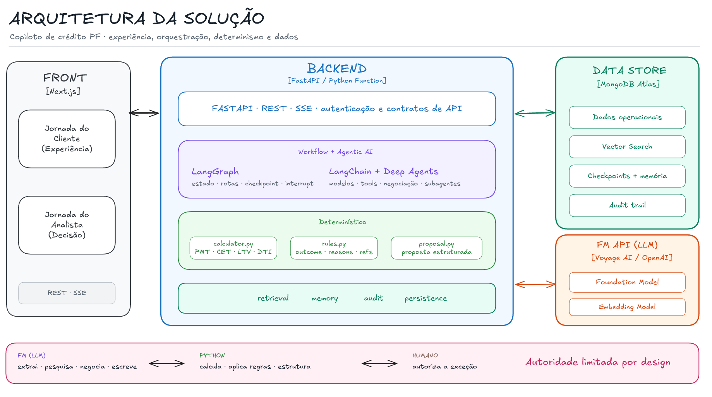
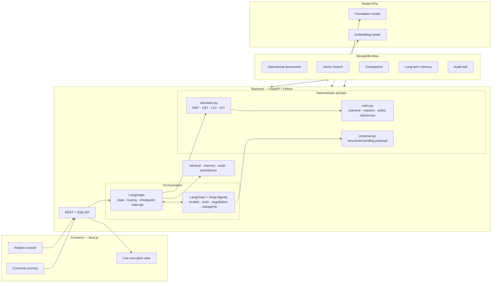
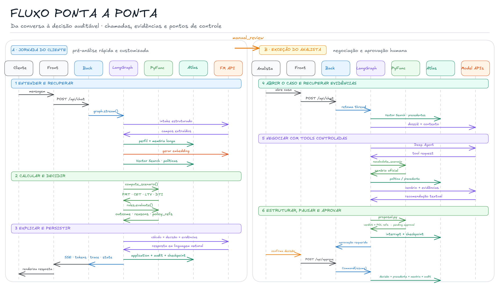
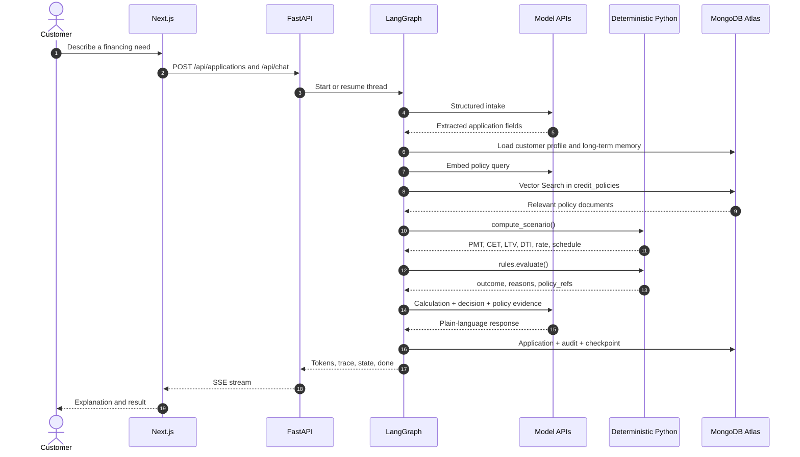
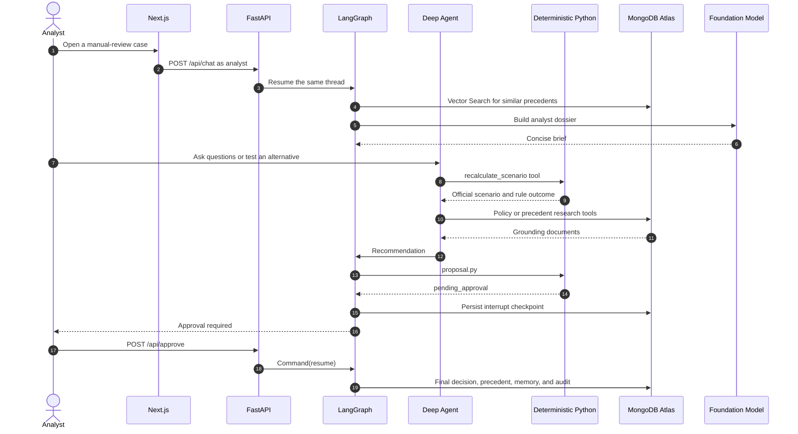

# FSI Credit Assistant

An explainable credit-origination copilot that supports both sides of the same application: a customer can simulate and understand a credit proposal, while an analyst receives a prepared case, retrieves applicable policies and similar precedents, tests alternative structures, and makes the final exception decision.

The reference implementation combines **Next.js**, **FastAPI**, **LangGraph**, **LangChain**, **Deep Agents**, foundation models, deterministic Python credit logic, and **MongoDB Atlas as the single data plane** for operational documents, vector search, workflow checkpoints, long-term memory, and audit events.

> [!IMPORTANT]
> This repository is a demonstration and reusable reference architecture, not a production credit-decisioning system. It uses synthetic data, simplified financial assumptions, no authentication, and simulated integrations. See [Production readiness](#production-readiness) before adapting it to a regulated environment.

The user experience and seeded policy corpus are in Brazilian Portuguese; this README is in English for broader technical reuse.

## Contents

- [Why this exists](#why-this-exists)
- [What the demo proves](#what-the-demo-proves)
- [Design principles](#design-principles)
- [Architecture](#architecture)
- [End-to-end flow](#end-to-end-flow)
- [Core components](#core-components)
- [MongoDB Atlas data model](#mongodb-atlas-data-model)
- [Repository structure](#repository-structure)
- [Prerequisites](#prerequisites)
- [Quick start](#quick-start)
- [Run with Docker Compose](#run-with-docker-compose)
- [Demo walkthrough](#demo-walkthrough)
- [API and SSE contract](#api-and-sse-contract)
- [Deterministic credit domain](#deterministic-credit-domain)
- [Retrieval, embeddings, and RAG](#retrieval-embeddings-and-rag)
- [Short-term and long-term memory](#short-term-and-long-term-memory)
- [Human approval and auditability](#human-approval-and-auditability)
- [Tests and evaluations](#tests-and-evaluations)
- [Configuration reference](#configuration-reference)
- [Troubleshooting](#troubleshooting)
- [Production readiness](#production-readiness)
- [Further documentation](#further-documentation)

## Why this exists

Credit journeys are not difficult only because of financial calculations. They are difficult because customer input, profile data, product policy, calculations, historical decisions, analyst judgment, and audit evidence usually live in different systems and interfaces.

This project explores a single controlled workflow for three perspectives:

| Perspective | Typical problem | What the solution demonstrates |
|---|---|---|
| Customer | Long forms, opaque outcomes, and no guidance on how to improve a proposal | Conversational intake, immediate simulation, plain-language explanation, and alternative scenarios |
| Analyst | Fragmented context, manual policy research, repeated calculations, and free-form justifications | A prepared dossier, policy and precedent retrieval, deterministic scenario tools, and a human approval gate |
| Institution | Long cycle time, inconsistent treatment, lost context, and fragmented audit trails | Shared calculations and rules, persistent workflow state, reusable precedents, and structured audit events |

The goal is not to let a model autonomously decide credit. The goal is to use models where language and open-ended research help, while keeping financial arithmetic, objective policy thresholds, state transitions, and exception authority under explicit control.

## What the demo proves

- A customer and an analyst can work on the same application and LangGraph thread.
- Free text can be converted into typed application fields before deterministic code executes.
- Policies and historical cases can be retrieved semantically from MongoDB Atlas Vector Search.
- PMT, CET, LTV, DTI, pricing, and amortization are calculated in Python, not by the model.
- Objective thresholds produce a deterministic `auto_approved`, `manual_review`, or `denied` result.
- A Deep Agent can negotiate alternative structures through controlled tools and two research subagents.
- A textual recommendation can be converted into a structured pending proposal without another model call.
- An exception cannot reach final persistence without crossing a LangGraph `interrupt()` and human resume.
- Workflow state survives process restarts through MongoDB-backed checkpoints.
- Final decisions become both auditable events and searchable precedents for future cases.

## Design principles

### Limit model authority by design

```text
Foundation model  -> extracts, researches, negotiates, and writes
Python domain     -> calculates, applies thresholds, and structures proposals
LangGraph         -> controls state, routes, checkpoints, and interruptions
Human analyst     -> authorizes exception decisions
MongoDB Atlas     -> stores data, evidence, state, memory, vectors, and audit events
```

### Prefer a workflow for the common path

The customer path is a fixed, observable workflow. A model does not decide which business step executes next. This keeps the most common journey predictable, cheaper, and easier to audit.

### Use an agent only where the problem is genuinely open-ended

The analyst path introduces a Deep Agent because finding a viable credit structure can require iterative research, scenario simulation, and negotiation. Even there, the agent must use deterministic calculation tools and cannot persist a final exception decision by itself.

### Keep one official implementation of financial calculations

Both the customer calculation node and the analyst's recalculation tool call the same `compute_scenario()` function. The two screens cannot silently disagree because of duplicated formulas.

### Treat retrieved documents as evidence, not executable authority

Policy Markdown is retrieved for grounding and explanation. Objective thresholds are explicitly encoded and tested in `domain/rules.py`. Similar historical cases inform an analyst; they never replace current policy.

## Architecture

LangChain, LangGraph, and Deep Agents are libraries running inside the same Python backend. They are not separate microservices. The foundation model and embedding model are external APIs selected by the backend.





### Technology responsibilities

| Layer | Technology | Responsibility |
|---|---|---|
| Experience | Next.js, React, Tailwind | Customer simulator, analyst console, decision cards, scenario table, and live trace |
| Transport | FastAPI, REST, SSE | API contracts, application hydration, streaming, health, history, trace, and approval resume |
| Orchestration | LangGraph | Typed state, deterministic routing, node order, checkpoints, and human interruption |
| Agent runtime | LangChain, Deep Agents | Model calls, tools, negotiation, delegation to policy and precedent subagents |
| Deterministic domain | Python | Financial calculations, pricing tables, credit thresholds, and proposal parsing |
| Data plane | MongoDB Atlas | Documents, Vector Search, checkpoints, memory, and audit events |
| Model providers | OpenAI and Voyage AI | Foundation-model inference and configurable embedding generation |

## End-to-end flow



### Customer path



The customer branch is:

```text
router
  -> intake
  -> load_context
  -> policy_retrieval
  -> credit_calculator
  -> decision
  -> customer_response
  -> END
```

If required data is missing, `intake` routes directly to `customer_response`, which asks only for the missing fields.

### Analyst path



The first analyst turn builds the dossier:

```text
router -> precedent_search -> analyst_brief -> END
```

Subsequent turns use the negotiation agent:

```text
router -> negotiation
                 | no verdict -> END
                 | verdict    -> await_approval -> persist_decision -> END
```

There is no graph edge from `negotiation` directly to `persist_decision`.

## Core components

### Backend entry points

| File | Purpose |
|---|---|
| `backend/app/main.py` | FastAPI application, REST endpoints, SSE mapping, application hydration, and graph startup |
| `backend/app/config.py` | Typed environment configuration loaded from the repository-root `.env` |
| `backend/app/db.py` | Cached `MongoClient` and database factory |
| `backend/app/llm.py` | Shared chat-model factory |
| `backend/app/embeddings.py` | Voyage/OpenAI embedding provider factory with 1,024 dimensions by default |
| `backend/app/audit.py` | Central writer for structured `decisions_log` events |

### Deterministic domain

| File | Purpose |
|---|---|
| `backend/app/domain/calculator.py` | Effective rate conversion, Price PMT, annual pricing, LTV, DTI, illustrative CET, and amortization preview |
| `backend/app/domain/rules.py` | Deterministic product thresholds and the `auto_approved` / `manual_review` / `denied` matrix |
| `backend/app/domain/formatting.py` | Stable Brazilian formatting used by user-facing reasons and policy-consistency tests |

`domain/` imports neither LangChain nor LangGraph. The model can choose which scenario to explore, but it cannot implement or override the official arithmetic and threshold evaluation.

### Agent layer

| File | Purpose |
|---|---|
| `backend/app/agent/negotiation.py` | Builds the main negotiation Deep Agent, exposes controlled tools, streams nested-agent output, and maps results back to graph state |
| `backend/app/agent/subagents.py` | Declares the policy researcher and precedent analyst subagents |
| `backend/app/agent/proposal.py` | Pure deterministic functions that detect an analyst verdict, extract cited `POL-xxx` IDs, and construct `pending_approval` |

The three files do **not** represent three agents. The business-facing agent topology is one main negotiation agent plus two research subagents. `proposal.py` is deterministic Python, not an agent.

### LangGraph layer

| Area | Purpose |
|---|---|
| `graph/state.py` | Typed application, calculation, decision, scenario, and message state |
| `graph/routing.py` | Pure-Python route selection and completeness/approval checks |
| `graph/builder.py` | Registers 12 nodes and connects the customer and analyst branches |
| `graph/nodes/` | Small workflow units for intake, retrieval, calculation, decision, response, dossier, approval, and persistence |
| `graph/tools/` | Controlled runtime tools for calculation, Open Finance evidence, policy retrieval, and precedent retrieval |
| `graph/prompts/` | Versioned model behavior instructions; these are not bank policy documents |

### Retrieval and memory

| Area | Purpose |
|---|---|
| `retrieval/policies.py` | Vector retrieval over `credit_policies`, filtered by product |
| `retrieval/precedents.py` | Vector retrieval over `historical_cases`, filtered by product and optionally LTV band |
| `memory/checkpointer.py` | MongoDB-backed short-term thread state in `checkpoints` and `checkpoint_writes` |
| `memory/store.py` | MongoDB-backed long-term customer and analyst memory in `agent_memories` |

Retrieval and memory are different concerns: retrieval finds policy and precedent evidence for the current task; memory preserves workflow state or selected facts across turns and threads.

## MongoDB Atlas data model

MongoDB Atlas acts as one data platform with five roles: operational store, knowledge store, workflow state, long-term memory, and audit trail.

| Collection | Role | Populated by | Read by | Vector Search |
|---|---|---|---|---:|
| `applications` | Current business state of each credit application | API, decision node, final persistence | API, graph hydration, UI | No |
| `customer_profiles` | Synthetic customer identity, employment, income, credit, relationship, and Open Finance context | Seed script | `load_context`, calculator/rules inputs, agent tools | No |
| `credit_policies` | Parsed policy metadata and text | Seed script | Customer policy RAG and policy researcher | Yes, over `text` embeddings |
| `historical_cases` | Initial and newly concluded credit precedents | Seed script and `persist_decision` | Analyst precedent search and subagent | Yes, over `summary` embeddings |
| `checkpoints` | Consolidated LangGraph state snapshots per thread | `MongoDBSaver` | LangGraph | No |
| `checkpoint_writes` | Intermediate checkpoint channel writes | `MongoDBSaver` | LangGraph | No |
| `agent_memories` | Long-term customer preferences/facts and analyst decision patterns | `persist_decision` through `MongoDBStore` | `load_context` and store APIs | Vector-ready, managed by the store |
| `decisions_log` | Ordered audit events and decision evidence | Audit helper and graph nodes | Trace API and UI | No |

### Seeded source data

| Source | Seed result |
|---|---|
| `data/profiles/profiles.json` | 3 separate documents in `customer_profiles`; no embeddings |
| `data/policies/POL-001.md` ... `POL-030.md` | 30 documents in `credit_policies`; YAML frontmatter becomes metadata and Markdown body becomes embedded `text` |
| `data/cases/cases.json` | 60 separate documents in `historical_cases`; `summary` becomes the embedded text |

The seed is idempotent: it upserts by `_id`. A content hash allows unchanged embeddings to be reused. Pass `--reembed` only when changing embedding model or dimensions, or when explicitly rebuilding all vectors.

### Indexes

`scripts/01_create_indexes.py` creates:

- a standard `{status: 1, created_at: -1}` index on `applications`;
- a standard `{application_id: 1, seq: 1}` index on `decisions_log`;
- `vector_index` on `credit_policies`, with `product` and `policy_type` filters;
- `vector_index` on `historical_cases`, with `product`, `decision`, and `ltv_band` filters.

`MongoDBStore` manages the vector configuration for `agent_memories`. `MongoDBSaver` manages checkpoint storage and a 24-hour TTL configuration for the short-term state collections.

## Repository structure

```text
fsi-credit-assistant/
├── .env.example                 # Environment-variable template
├── Makefile                     # Backend setup, seed, run, test, and eval commands
├── docker-compose.yml           # API + web; connects to an external Atlas cluster
├── Dockerfile.api
├── Dockerfile.web
│
├── backend/
│   ├── pyproject.toml           # Python 3.12 dependencies and pytest configuration
│   ├── uv.lock                  # Reproducible Python dependency lock
│   ├── app/
│   │   ├── main.py              # FastAPI and SSE
│   │   ├── config.py            # Typed settings
│   │   ├── db.py                # MongoDB client
│   │   ├── embeddings.py        # Embedding provider
│   │   ├── llm.py               # Foundation-model factory
│   │   ├── audit.py             # Structured audit writer
│   │   ├── agent/               # Deep Agent, subagents, proposal parser
│   │   ├── domain/              # Deterministic credit arithmetic and rules
│   │   ├── graph/               # State, workflow, nodes, prompts, and tools
│   │   ├── memory/              # MongoDB checkpointer and long-term store
│   │   └── retrieval/           # Policy and precedent Vector Search
│   ├── scripts/                 # Atlas probe, indexes, seed, retrieval eval, latency measure
│   └── tests/                   # Unit, contract, graph, API, memory, and SSE tests
│
├── data/
│   ├── profiles/                # Synthetic customer profiles
│   ├── policies/                # 30 Portuguese policy documents
│   └── cases/                   # 60 synthetic decided cases
│
├── frontend/
│   ├── app/                     # Customer and analyst Next.js routes
│   ├── components/              # Shared UI and live architecture/trace panels
│   ├── hooks/                   # SSE streaming and replay
│   └── lib/                     # API contract, types, policy text, architecture metadata
│
└── docs/
    ├── demo-overview-pt.md       # Business-oriented Portuguese overview
    └── specs/                    # Detailed architecture and implementation specifications
```

## Prerequisites

### Local development

- Git
- Python 3.12 or newer
- [`uv`](https://docs.astral.sh/uv/) for Python dependency management
- Node.js 20 or newer and npm
- `make` for the convenience targets, or run the underlying commands directly

### External services

- A MongoDB Atlas cluster that supports Atlas Vector Search; the project was built and rehearsed against an M10 cluster
- An Atlas database user scoped to `readWrite` on the application database
- Your current IP address in the Atlas network access list
- An OpenAI API key for the foundation model
- Either:
  - a Voyage AI API key for `voyage-4-lite` embeddings; or
  - OpenAI embeddings through `text-embedding-3-small`

The application does not require an Atlas Admin API key. Search indexes are created through the MongoDB driver.

## Quick start

### 1. Clone the repository

```bash
git clone https://github.com/thoravieira/fsi-credit-assistant.git
cd fsi-credit-assistant
```

### 2. Configure environment variables

```bash
cp .env.example .env
```

At minimum, set:

```dotenv
MONGODB_URI=mongodb+srv://credit_app:<password>@<cluster>.mongodb.net/?retryWrites=true&w=majority
MONGODB_DB=credit_assistant

OPENAI_API_KEY=sk-...
LLM_MODEL=<model-id-available-to-your-account>

EMBEDDING_PROVIDER=voyage
VOYAGE_API_KEY=pa-...
EMBEDDING_DIMENSIONS=1024
```

To use OpenAI embeddings instead:

```dotenv
EMBEDDING_PROVIDER=openai
EMBEDDING_DIMENSIONS=1024
```

Do not commit `.env`. URL-encode special characters in the MongoDB password.

### 3. Install backend dependencies

```bash
make setup
```

Equivalent command:

```bash
cd backend
uv sync
cd ..
```

### 4. Optionally verify the Atlas environment

```bash
cd backend
uv run python scripts/00_check_atlas.py
cd ..
```

This is an **active probe**, not a read-only ping. It creates temporary collections and search indexes, measures real vector-search latency, verifies checkpoint TTL behavior, and removes its scratch resources before exiting.

### 5. Create indexes and seed Atlas

```bash
make seed
```

Equivalent commands:

```bash
cd backend
uv run python scripts/01_create_indexes.py
uv run python scripts/02_seed.py
cd ..
```

Index creation can take a few minutes. The command waits for the search indexes to become queryable.

To force re-embedding after changing provider or dimensions:

```bash
cd backend
uv run python scripts/02_seed.py --reembed
```

Changing dimensions also requires recreating/updating the vector-index definitions before re-seeding.

### 6. Start the backend

```bash
make dev
```

The API is available at:

- `http://localhost:8000`
- `http://localhost:8000/docs` for OpenAPI/Swagger UI
- `http://localhost:8000/api/health` for Atlas and vector-index health

### 7. Start the frontend

In a second terminal:

```bash
cd frontend
npm install
npm run dev
```

Open:

- `http://localhost:3000` — customer journey
- `http://localhost:3000/console` — analyst queue and negotiation console

The frontend defaults to `http://localhost:8000`. `NEXT_PUBLIC_API_URL` is embedded into the client bundle at build time, so set it before `npm run build` when targeting another API address.

## Run with Docker Compose

MongoDB is intentionally not part of `docker-compose.yml`. Both containers connect to the real Atlas database configured in the root `.env`.

Prepare Atlas once from the host:

```bash
make setup
make seed
```

Then build and run both services:

```bash
docker compose up --build
```

Open:

- Web: `http://localhost:3000`
- API: `http://localhost:8000`
- API health: `http://localhost:8000/api/health`

Stop the services with:

```bash
docker compose down
```

The API image does not bundle the repository-root `data/` directory, so perform index creation and seed from the host before using Compose against a new database.

## Demo walkthrough

The seeded profiles and policies are designed for a two-persona demonstration.
For a rehearsed 7–9 minute narrative with literal prompts, expected figures, audience
questions, and the customer-to-analyst-to-contract arc, use the
[`docs/demo-storytelling-pt.md`](docs/demo-storytelling-pt.md) runbook.

### Customer journey

1. Open `http://localhost:3000`.
2. Create a mortgage or auto-financing simulation.
3. Send the first customer message.
4. Watch the live view show intake, context loading, policy retrieval, calculation, decision, and response.
5. Inspect the decision card for payment, CET, LTV, DTI, reasons, and policy references.
6. If the application requires `manual_review`, switch to the analyst console.

### Analyst journey

1. Open `http://localhost:3000/console`.
2. Select the manual-review application.
3. Let the first analyst turn retrieve precedents and build a dossier.
4. Ask for an explanation of the applicable policy.
5. Test a scenario with a larger down payment, different term, or allowed rate.
6. Ask the agent to consider available Open Finance evidence.
7. State an explicit verdict such as approval, conditional approval, or denial.
8. Review the structured pending proposal.
9. Confirm the human decision.
10. Observe final persistence to the application, audit log, precedent base, and long-term memory.

The right-side frontend panel exposes the runtime trace so an audience can see whether a step is being executed by FastAPI, LangGraph, a model, deterministic Python, retrieval, or MongoDB Atlas.

## API and SSE contract

### REST endpoints

| Method | Path | Purpose |
|---|---|---|
| `POST` | `/api/applications` | Create an application and use its ID as the LangGraph thread ID |
| `GET` | `/api/applications` | List applications, optionally filtered by `status` or `customer_id` |
| `GET` | `/api/applications/{application_id}` | Read the current business-state document |
| `GET` | `/api/history/{thread_id}` | Read human/assistant conversation turns from the LangGraph checkpoint |
| `GET` | `/api/trace/{thread_id}` | Read ordered structured events from `decisions_log` |
| `GET` | `/api/runtime-trace/{thread_id}` | Restore the last runtime trace turns, optionally filtered by persona |
| `GET` | `/api/health` | Ping Atlas and report vector-index availability |
| `POST` | `/api/chat` | Stream one customer or analyst turn over SSE |
| `POST` | `/api/approve` | Resume an interrupted graph with the human verdict |
| `POST` | `/api/contract` | Record customer acceptance without re-running credit assessment |

### Create an application

```bash
curl -X POST http://localhost:8000/api/applications \
  -H 'Content-Type: application/json' \
  -d '{
    "customer_id": "CUST-001",
    "product": "mortgage",
    "asset_value": 400000,
    "down_payment": 100000,
    "term_months": 360,
    "purpose": "Residential property purchase"
  }'
```

The response contains the ID used for both application and thread:

```json
{
  "application_id": "APP-20260812-0001"
}
```

### Stream a chat turn

```bash
curl -N -X POST http://localhost:8000/api/chat \
  -H 'Content-Type: application/json' \
  -d '{
    "thread_id": "APP-20260812-0001",
    "persona": "customer",
    "message": "I would like to simulate this mortgage."
  }'
```

### SSE event types

| Event | Meaning |
|---|---|
| `token` | A customer-facing piece of generated text |
| `trace` | A node boundary, tool/subagent step, timing, or interruption |
| `state` | Final public state for the turn: stage, calculation, decision, pending approval, and scenarios |
| `done` | End of the stream for that turn |

The frontend uses `fetch()` plus `ReadableStream`, not `EventSource`, because `/api/chat` and
`/api/approve` are `POST` requests. Runtime events carry a durable `turn_id`, sequence, source,
and label; the latest 12 turns are restored from `trace_log` after a reload or case reopen.

### Resume human approval

```bash
curl -N -X POST http://localhost:8000/api/approve \
  -H 'Content-Type: application/json' \
  -d '{
    "thread_id": "APP-20260812-0001",
    "resume": {
      "outcome": "approved_with_conditions",
      "approved_by": "ANALYST-CARLOS",
      "notes": "Approved after validating the revised scenario."
    }
  }'
```

The demo does not authenticate this endpoint. A production implementation must derive analyst identity and approval authority from an authenticated session rather than accepting arbitrary client-supplied fields.

Approval is also an SSE stream. It exposes the real `persist_decision` boundary plus the
audit-log, application-update, precedent-upsert, and memory-write milestones before `state`
and `done`. Customer acceptance has its own `contract_acceptance` trace so the narrative stays
explainable after the credit decision.

## Deterministic credit domain

### Calculations

`backend/app/domain/calculator.py` is the official calculation implementation for both personas.

| Output | Meaning | Demo formula or method |
|---|---|---|
| PMT | Fixed monthly installment | Price formula using the effective monthly rate |
| LTV | Loan-to-value | `financed amount / asset value` |
| DTI | Debt-to-income | `(new payment + existing monthly debt) / net monthly income` |
| CET | Annualized total effective cost | IRR of net proceeds versus installment plus illustrative costs, solved by bisection |
| Annual rate | Product pricing | Deterministic rate tables transcribed from `POL-018` and `POL-019` |
| Schedule preview | Amortization evidence | First two and final Price-schedule rows |

The annual-to-monthly conversion is effective:

```text
monthly_rate = (1 + annual_rate) ** (1 / 12) - 1
```

The demo uses `float` and illustrative insurance, appraisal-fee, and IOF assumptions. Production financial code should use `Decimal` or integer cents, institution-approved rounding, complete product fees, and reconciliation against the official pricing engine.

### Decision rules

`backend/app/domain/rules.py` evaluates the calculated facts against explicit product thresholds.

```text
Absolute threshold breached  -> denied
No absolute breach, but not all auto criteria pass -> manual_review
All auto-approval criteria pass -> auto_approved
```

Every threshold carries the corresponding `POL-xxx` reference. `test_policy_consistency.py` checks that encoded values remain consistent with the cited policy documents.

Policy documents and executable rules have different jobs:

```text
data/policies/*.md  -> human-readable, searchable, and citable policy evidence
domain/rules.py     -> deterministic execution of selected objective thresholds
```

The retrieved Markdown is not dynamically interpreted and executed by the model. Not every textual policy is represented as executable code because some policies require fields that the demo does not model.

### Deterministic proposal parsing

`backend/app/agent/proposal.py` runs after a negotiation answer and:

- normalizes accents and casing;
- safely orders verdict keywords so, for example, denial is not mistaken for approval;
- returns no proposal for unrecognized wording, causing the negotiation to continue safely;
- extracts unique `POL-xxx` references from the agent response;
- combines the verdict, official scenario, rationale, policies, and precedents into `pending_approval`.

It does not make the final human decision. It also does not yet prove that every cited policy exists, was retrieved, is currently effective, or applies to the product. Those are recommended production guardrails.

## Retrieval, embeddings, and RAG

### Policy RAG

The customer workflow builds a semantic query from product and estimated application characteristics, embeds it, and retrieves the top policy documents from `credit_policies` with a product pre-filter.

The policy-researcher subagent uses the same internal source during analyst negotiation. Its prompt requires `POL-xxx` citations and instructs it not to fill gaps from general model knowledge.

### Precedent RAG

The analyst workflow creates a narrative of the current case and retrieves similar `historical_cases`. Product is always filtered; LTV band can also narrow retrieval.

Precedents are supporting context, not current policy. They show how similar cases were handled but cannot authorize an exception.

### Embedding providers

`backend/app/embeddings.py` exposes a common LangChain `Embeddings` interface:

```text
EMBEDDING_PROVIDER=voyage
  -> voyage-4-lite

EMBEDDING_PROVIDER=openai
  -> text-embedding-3-small
```

Both are configured for 1,024 dimensions. Embeddings are generated by the selected external API. MongoDB Atlas stores the vectors, applies metadata filters, and executes Vector Search.

Changing provider without rebuilding can mix incompatible vector spaces. Recreate or update the indexes as needed, then run the seed with `--reembed`.

## Short-term and long-term memory

### Short-term memory: workflow checkpoints

`MongoDBSaver` serializes graph state to:

- `checkpoints` — consolidated state snapshots;
- `checkpoint_writes` — intermediate channel writes.

This supports multi-turn conversations, process restart recovery, and durable human interruption. Checkpoints are configured with a 24-hour TTL for the demo.

### Long-term memory: agent store

`MongoDBStore` writes structured memory to `agent_memories` under namespaces such as:

```text
customer/{customer_id}/preferences
customer/{customer_id}/facts
analyst/{analyst_id}/decision_patterns
```

Final persistence writes customer preferences/facts and an analyst decision pattern. The customer context loader reads customer memories in future interactions.

The store is vector-enabled, but the current runtime mainly retrieves customer memories by namespace without a semantic query. Analyst decision patterns are written but are not yet consumed by the current workflow.

## Human approval and auditability

When the agent detects an explicit analyst verdict, the graph routes to `await_approval` and calls `interrupt(pending_approval)`. LangGraph persists the pause in Atlas and waits for `/api/approve` to resume execution.

After resume, `persist_decision` performs the final effects:

1. append the final decision to `decisions_log`;
2. update the current document in `applications`;
3. create an embedded document in `historical_cases`;
4. write long-term entries to `agent_memories`.

`decisions_log` is an event timeline; `applications` is the latest business-state snapshot. Keeping both makes it possible to answer both “what is the result now?” and “how did the workflow reach it?”

The current multi-collection writes are not wrapped in an explicit transaction. Production must define idempotency, transactional boundaries, retry behavior, and reconciliation for partial failures.

## Tests and evaluations

### Backend tests

Run the complete test suite:

```bash
make test
```

Or:

```bash
cd backend
uv run pytest
```

The suite covers:

- PMT, effective-rate conversion, CET, LTV, DTI, pricing, and amortization;
- product thresholds, boundary cases, outcomes, citations, and missing evidence;
- consistency between `rules.py` values and policy Markdown;
- graph state reducers and deterministic routing;
- customer and analyst nodes;
- graph wiring, multi-turn behavior, interrupt, and resume;
- Deep Agent tools, subagents, streaming, and runtime-context isolation;
- proposal parsing and safe verdict detection;
- memory/checkpointer integration contracts;
- SSE event mapping and FastAPI endpoints.

### Retrieval evaluation

```bash
make eval
```

This runs ten golden policy queries and reports:

- recall@3;
- recall@5;
- mean top-1 score;
- the weakest query for manual review.

The health gate is `recall@3 >= 0.8`. The script requires Atlas and an embedding API and rewrites `docs/retrieval-eval.md`.

### Negotiation latency measurement

```bash
cd backend
uv run python scripts/04_measure_negotiation.py
```

This executes a real multi-turn route and measures total time, time to first token, nodes, tools, and subagents. It temporarily writes test state to Atlas and cleans it afterward.

### Frontend validation

```bash
cd frontend
npm run build
```

The frontend consumes the real API and SSE contract; it does not use a mock server.

## Configuration reference

| Variable | Required | Default | Description |
|---|---:|---|---|
| `MONGODB_URI` | Yes | — | Dedicated Atlas database-user connection string |
| `MONGODB_DB` | Yes | — | Application database, normally `credit_assistant` |
| `OPENAI_API_KEY` | Yes | — | Foundation-model API key; also used when OpenAI embeddings are selected |
| `LLM_MODEL` | Yes | — | Exact model ID available to the account; recorded in audit events |
| `EMBEDDING_PROVIDER` | No | `voyage` | `voyage` or `openai` |
| `VOYAGE_API_KEY` | For Voyage | — | Voyage AI key |
| `EMBEDDING_DIMENSIONS` | No | `1024` | Must match stored vectors and vector-index definitions |
| `API_HOST` | No | `0.0.0.0` | Uvicorn bind host |
| `API_PORT` | No | `8000` | Uvicorn port |
| `NEXT_PUBLIC_API_URL` | No | `http://localhost:8000` | Browser-visible API URL, embedded at frontend build time |
| `LANGSMITH_TRACING` | No | `false` | Optional LangSmith tracing switch |
| `LANGSMITH_API_KEY` | If tracing | — | LangSmith key |
| `LANGSMITH_PROJECT` | If tracing | — | LangSmith project name |

Tracing is useful during graph development but adds latency. Disable it before latency-sensitive demos unless it is part of what you intend to show.

## Troubleshooting

### Atlas connection fails

Check:

- the application uses a dedicated database user, not the Atlas UI account;
- the database user has `readWrite` on `MONGODB_DB`;
- the current IP is in the Atlas network access list;
- special characters in the connection-string password are URL-encoded;
- the cluster is active and reachable from the venue or network.

Then run:

```bash
curl http://localhost:8000/api/health
```

### A vector index is missing or not queryable

Run:

```bash
cd backend
uv run python scripts/01_create_indexes.py
```

Wait for the index to become queryable, then check `/api/health` again.

### Vector dimensions or provider changed

Do not mix vectors from different providers or dimensions. Update/recreate the search indexes and then run:

```bash
cd backend
uv run python scripts/02_seed.py --reembed
```

### The frontend cannot reach the API

- Confirm the API is listening on port 8000.
- Confirm `NEXT_PUBLIC_API_URL` is an address the browser can reach.
- Rebuild the frontend after changing any `NEXT_PUBLIC_*` variable.
- The demo CORS allowlist includes only `localhost:3000` and `127.0.0.1:3000`.

### The UI appears idle during a long negotiation turn

The nested Deep Agent forwards tokens and tool/subagent steps through LangGraph's custom stream mode. Check the browser network stream and `/api/trace/{thread_id}`. Model latency varies by provider and selected model; use `scripts/04_measure_negotiation.py` before a live presentation.

### A conversation cannot be resumed after a long delay

Short-term checkpoints are configured with a 24-hour TTL in this demo. Long-term memory is a different collection and does not reconstruct an expired graph execution by itself.

### `make demo-reset` fails

In the current snapshot, the Makefile target passes `--reset`, while `scripts/02_seed.py` exposes only `--reembed`. Use the idempotent seed directly:

```bash
make seed
```

or force vector regeneration with `--reembed`. Review and align the Makefile target before relying on a destructive demo-reset workflow.

## Production readiness

This codebase is intentionally optimized for an explainable demonstration and architectural reuse. A production program should treat it as an accelerator and address the following areas.

### Data and integration

- Replace synthetic profiles, policies, and precedents with governed sources.
- Integrate the institution's customer, bureau, pricing, origination, and decision systems.
- Replace simulated Open Finance data with a consent-aware, purpose-bound integration.
- Define data ownership, lineage, quality checks, retention, and deletion.

### Financial correctness

- Replace `float` with `Decimal` or integer cents.
- Reconcile every calculation and rounding rule with the official financial engine.
- Implement complete taxes, insurance, tariffs, product variants, and contractual CET.
- Version pricing and rule tables by product and effective date.

### Policy governance

- Establish a single governed source for policy text and executable rules.
- Filter retrieval by effective date, version, product, jurisdiction, and approval status.
- Validate that every cited policy exists, was retrieved, is applicable, and is effective.
- Add a deterministic no-evidence path instead of allowing unsupported model knowledge.
- Require four-eyes approval, rollout, rollback, and automated consistency tests for policy changes.

### Identity and authorization

- Add enterprise authentication and role-based access control.
- Derive customer and analyst identity from authenticated sessions.
- Enforce decision authority and committee escalation in code.
- Protect `/api/approve`; never trust free-form approval fields from a browser.
- Add field-level access control for sensitive financial and personal data.

### Reliability and persistence

- Replace count-based application and audit sequence generation with concurrency-safe IDs/counters.
- Define idempotency keys for create, approve, and persistence operations.
- Add transactions or a recoverable orchestration strategy for multi-collection writes.
- Add retries, dead-letter handling, reconciliation, backups, and disaster recovery.
- Separate transient trace telemetry from the regulatory audit record when required.

### Privacy, security, and compliance

- Perform LGPD assessment, legal-basis mapping, minimization, and retention design.
- Enforce explicit Open Finance consent, allowed scope, expiration, and revocation.
- Establish model-provider data controls, redaction, encryption, secret management, and network boundaries.
- Provide appropriate explanation and review paths for automated decisions.
- Conduct threat modeling, prompt-injection testing, dependency scanning, and penetration testing.

### Model governance and observability

- Build positive and negative retrieval evaluation sets, including a no-answer threshold.
- Validate tool arguments and outputs with strict schemas.
- Monitor invalid citations, unsupported claims, calculation divergence, overrides, latency, cost, and failures.
- Pin and evaluate model/prompt versions before promotion.
- Add regression evaluation by product, segment, language, and risk outcome.

### Recommended adoption path

```text
1. Shadow mode
   Observe real cases without influencing the official decision.

2. Read-only analyst copilot
   Provide dossiers, policy evidence, precedents, and simulations.

3. Human-confirmed recommendations
   Allow structured proposals but require authenticated approval.

4. Customer pre-qualification
   Expose estimates reconciled with official engines.

5. Selective automation
   Automate only verified, low-complexity cases fully within policy.
```

Expand system authority only after evidence, controls, and business metrics justify it.

## Further documentation

- [`docs/demo-overview-pt.md`](docs/demo-overview-pt.md) — concise Portuguese business overview
- [`docs/demo-storytelling-pt.md`](docs/demo-storytelling-pt.md) — rehearsed Portuguese demo narrative with literal prompts and expected outcomes
- [`docs/specs/00-overview.md`](docs/specs/00-overview.md) — scope and system overview
- [`docs/specs/01-architecture.md`](docs/specs/01-architecture.md) — architecture decisions
- [`docs/specs/02-data-model.md`](docs/specs/02-data-model.md) — collections and document shapes
- [`docs/specs/03-atlas-indexes.md`](docs/specs/03-atlas-indexes.md) — Atlas and Vector Search indexes
- [`docs/specs/04-graph-state.md`](docs/specs/04-graph-state.md) — LangGraph state model
- [`docs/specs/05-graph-nodes-and-routing.md`](docs/specs/05-graph-nodes-and-routing.md) — nodes and routing
- [`docs/specs/06-negotiation-agent.md`](docs/specs/06-negotiation-agent.md) — agent, tools, subagents, and approval
- [`docs/specs/07-memory.md`](docs/specs/07-memory.md) — short-term and long-term memory
- [`docs/specs/08-retrieval.md`](docs/specs/08-retrieval.md) — policy and precedent RAG
- [`docs/specs/09-retrieval-eval.md`](docs/specs/09-retrieval-eval.md) — retrieval evaluation strategy
- [`docs/specs/10-domain-credit.md`](docs/specs/10-domain-credit.md) — deterministic calculations and rules
- [`docs/specs/11-api-sse.md`](docs/specs/11-api-sse.md) — API and streaming contract
- [`docs/specs/12-frontend.md`](docs/specs/12-frontend.md) — Next.js experience
- [`docs/specs/13-verified-api-contract.md`](docs/specs/13-verified-api-contract.md) — verified framework contracts
- [`docs/specs/14-repo-and-testing.md`](docs/specs/14-repo-and-testing.md) — repository and testing strategy
- [`docs/specs/15-risks-and-open-items.md`](docs/specs/15-risks-and-open-items.md) — known risks and open items
- [`docs/specs/16-demo-plan.md`](docs/specs/16-demo-plan.md) — live demonstration plan
- [`docs/specs/17-objection-bank.md`](docs/specs/17-objection-bank.md) — anticipated questions and objections

## Closing idea

The central architectural choice is not to trust a model with more authority. It is to use a model where natural language and open-ended research create value, while deterministic code, explicit workflow edges, human approval, and persistent evidence keep the credit process controlled and explainable.
