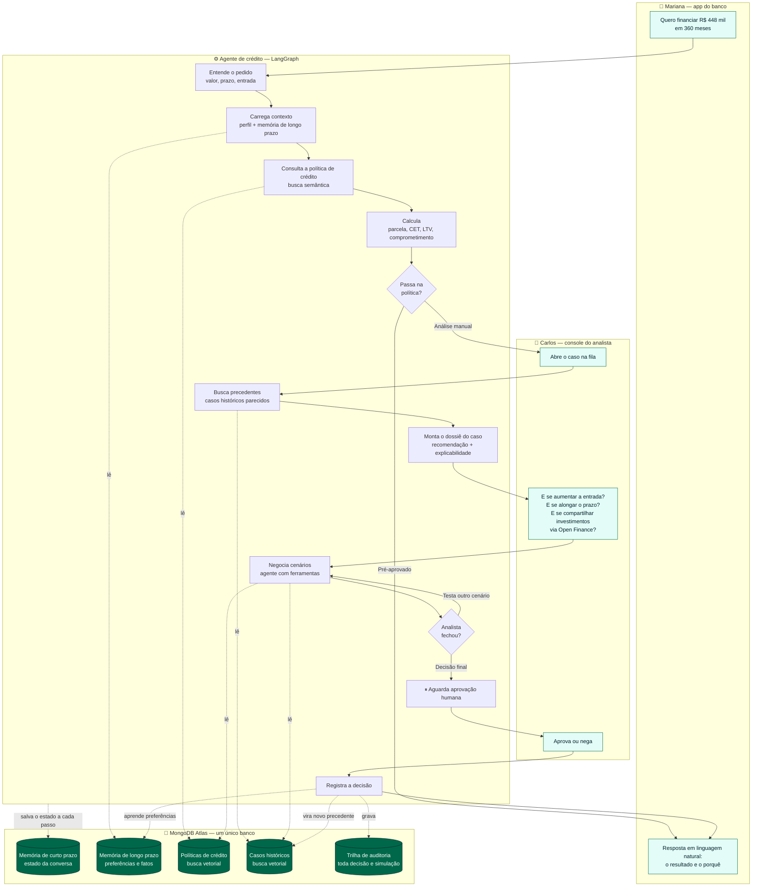

# Copiloto de Crédito PF — visão geral da demo

> Documento em português, voltado para validação de negócio.
> A especificação técnica está em [`docs/specs/`](specs/00-overview.md), em inglês.

---

## O que é

Um copiloto de originação de crédito para pessoa física — financiamento imobiliário e de
veículo — construído sobre um agente de IA orquestrado com LangGraph, tendo o MongoDB Atlas
como único banco de dados de toda a arquitetura.

## O problema

Hoje a originação de crédito trava nas duas pontas. **O cliente** entra num funil opaco:
simula, não entende por que foi negado, e quando o pedido cai em análise manual fica dias
sem resposta. **O analista** recebe um caso cru e refaz a análise do zero a cada cenário
alternativo — reduzir o valor, aumentar a entrada, alongar o prazo, aceitar garantia
adicional. Cada "e se" é uma rodada de planilha, consulta a política e busca de casos
parecidos na memória de quem já viu muito caso. O resultado é caro dos dois lados: o banco
perde negócio bom por lentidão e o cliente desiste sem saber o que faltava.

## O que a demo resolve

O agente atua nas duas pontas do mesmo pedido. Para a cliente, ele simula, aplica a política
de crédito e responde em linguagem natural **por que** o pedido foi pré-aprovado ou por que
precisa de análise — não só o resultado. Para o analista, ele chega com o caso já
instruído: recomendação, comprometimento de renda, LTV, os artigos da política que se
aplicam e casos históricos parecidos com o desfecho de cada um. E aí vem o núcleo: o
analista conversa com o agente testando cenários, e cada "e se" é re-simulado em segundos,
com o cálculo feito por código determinístico — o modelo escolhe o cenário, a matemática
não é inventada por ele. Nada é gravado como decisão sem aprovação humana explícita, e toda
simulação, **inclusive as descartadas**, vira trilha de auditoria. A decisão de hoje é
indexada e vira o precedente recuperado no caso de amanhã: o sistema melhora com o uso, sem
retreinar modelo nenhum.

## Benefícios

| Para o cliente | Para o analista | Para o banco |
|---|---|---|
| Resolve sozinho quando o caso é simples | Copiloto que testa cenários em segundos | Menos casos escalados sem necessidade |
| Entende o motivo, não só o "não" | Chega no caso já instruído, não cru | Trilha de auditoria completa e consultável |
| Sabe o que fazer para virar o jogo | Mantém a decisão na mão dele | Conhecimento institucional que acumula |

## Por que MongoDB

Um agente precisa de quatro coisas ao mesmo tempo: dados operacionais, estado da conversa,
memória de longo prazo e busca semântica. O caminho convencional resolve isso com quatro
sistemas diferentes — banco relacional, cache, banco vetorial, mais um store de memória.
Aqui é **um cluster só**: um driver, um modelo de consistência, uma política de backup, uma
superfície de segurança.

---

## Fluxo da demo

### Como ler o diagrama

- **Linha cheia** = fluxo do pedido. **Linha pontilhada** = leitura ou escrita no MongoDB.
- O ciclo `A8 ⇄ A9` é o coração da demo: cada "e se" do analista é uma volta ali, em segundos.
- O `⏸` antes de gravar é literal — o agente pausa e só continua com aprovação humana.
- A seta `A11 → D4` fecha o ciclo de aprendizado: a decisão de hoje é o precedente de amanhã.
- Mariana e Carlos estão na **mesma conversa** do ponto de vista do sistema; o contexto dela
  chega até ele sem nenhum handoff explícito.
