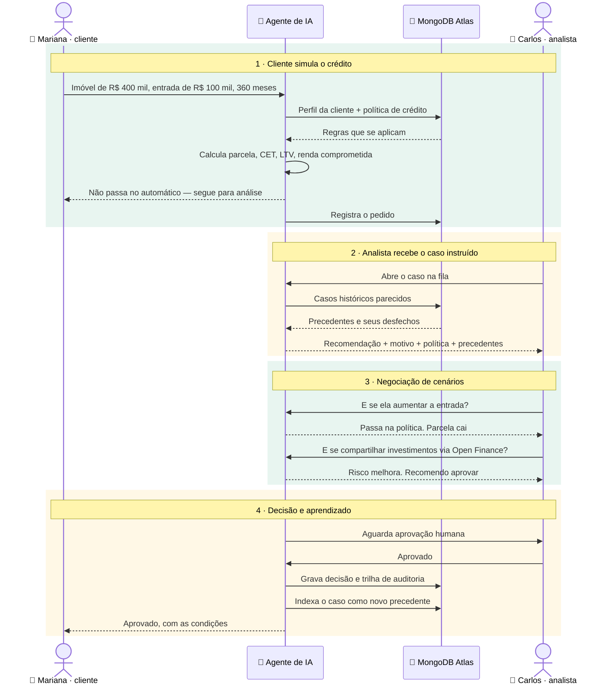

# Copiloto de Crédito PF — visão geral da demo

> Documento em português, para validação de negócio.
> Especificação técnica em [`docs/specs/`](specs/00-overview.md).

---

## Em uma frase

Um copiloto de crédito PF que atende as duas pontas do mesmo pedido. A cliente simula e
entende **por que** passou ou não; o analista recebe o caso já instruído — recomendação,
política aplicável e casos parecidos — e testa cenários alternativos em segundos, com o
cálculo feito por código, não pelo modelo. Nada vira decisão sem aprovação humana, tudo fica
em trilha de auditoria, e cada decisão vira precedente para o próximo caso. Tudo em um único
banco: MongoDB Atlas.

---

## Fluxo da demo

**Quatro etapas:** a cliente simula · o analista recebe o caso pronto · negocia cenários ·
decide, e a decisão vira aprendizado.

**Quatro componentes:** cliente · analista · agente de IA · MongoDB Atlas — que guarda
sozinho os dados, a memória da conversa, o histórico e a busca semântica.
