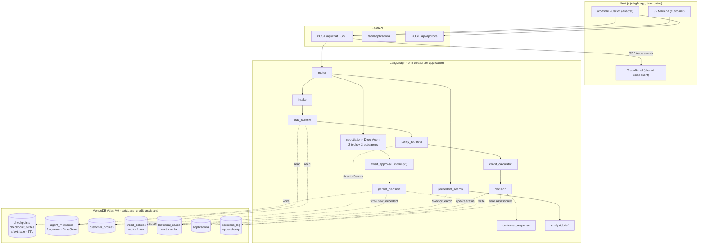

# SDD 01 — Architecture

> Part of the [FSI Credit Assistant SDD](00-overview.md) · Satisfies **R6**
> **Feeds:** every other file. Read this first.

---

## 1. System diagram

Source lives in `docs/diagrams/graph.mmd`. Export a PNG for the slide deck; keep the `.mmd`
as the version-controlled truth (GitHub renders it natively).

---

## 2. The central thesis

One database serves four workloads that a conventional stack splits across four systems.
**This table is a comparison** — the middle column is the cost of the usual path, the right
column is what this demo actually runs:

| Workload | Conventional stack → **4 systems** | This demo → **1 system** |
|---|---|---|
| Operational records | PostgreSQL | MongoDB · `applications`, `customer_profiles` |
| Agent state / checkpoints | Redis | MongoDB · `checkpoints` (+ TTL index) |
| Long-term agent memory | PostgreSQL + pgvector | MongoDB + Voyage AI · `agent_memories` |
| Vector search | Pinecone / Weaviate | MongoDB + Voyage AI · `credit_policies`, `historical_cases` |

Fewer moving parts, one consistency model, one driver, one connection pool, one backup
policy, one access-control surface. This is the argument the demo makes.

> **Talk track for the panel.** Do not just show the table — say the consequence out loud.
> Four systems means four failure modes, four consistency models, four upgrade cycles,
> four security reviews, and four sets of credentials in the agent's environment. Then note
> what the table does *not* claim: **Voyage AI appears in the right column too**, because
> any vector approach needs an embedding model — that is not a point being scored, it is
> the same cost on both sides. Being scrupulous about what the comparison does not prove is
> what makes the part it does prove credible. See [17](17-objection-bank.md).

---

## 3. Component responsibilities

| Component | Owns | Explicitly does not own |
|---|---|---|
| **Next.js app** | Rendering, persona switching, SSE consumption | Any business logic, any calculation |
| **FastAPI** | HTTP surface, SSE translation, application CRUD | Agent decisions, arithmetic |
| **LangGraph graph** | Orchestration, routing, when to call what | Arithmetic (delegated to `domain/`), persistence mechanics |
| **`domain/calculator.py`** | All financial arithmetic | Anything involving an LLM |
| **`domain/rules.py`** | The decision matrix | Explanation prose |
| **MongoDB Atlas** | All state, all knowledge, all audit | — |

The strict separation between `domain/` and the graph is what makes the answer to *"how do
you stop it hallucinating numbers?"* a demonstration rather than an assurance: the LLM
chooses which scenario to evaluate, deterministic Python evaluates it.

---

## 4. Degradation guarantee

The system is layered so that failure in the outermost layer costs presentation polish, not
technical content.

| Failing layer | What still works | How to demo it |
|---|---|---|
| Next.js frontend | Everything | `curl -N -X POST localhost:8000/api/chat -d '{...}'` streams the identical SSE events |
| LLM provider | Deterministic path: intake (degraded) → calculator → decision → rules-based output | Show that the graph structure makes this a node-level failure, not a system failure |
| Atlas | Nothing | This is the point. Have the Thursday screen recording ready ([15](15-risks-and-open-items.md), risk 3) |

**Design constraint that makes this real:** the FastAPI process must hold *no*
conversational state in memory. Every request reconstructs state from the checkpointer. The
graph is built once per process, never per session. This is also what makes the
kill-and-resume demo beat work ([07 §3](07-memory.md)).

The exact `curl` commands belong in `docs/demo-script.md` and must be tested on Thursday,
not improvised on Friday.

---

## Acceptance criteria

- [ ] `docs/diagrams/graph.mmd` renders on GitHub without errors.
- [ ] A PNG export exists for the slide deck.
- [ ] The `curl` fallback for `/api/chat` is written down and verified to stream events.
- [ ] `docs/architecture.md` (the reader-facing narrative version of this file) exists for
      people who clone the repo after the presentation.
